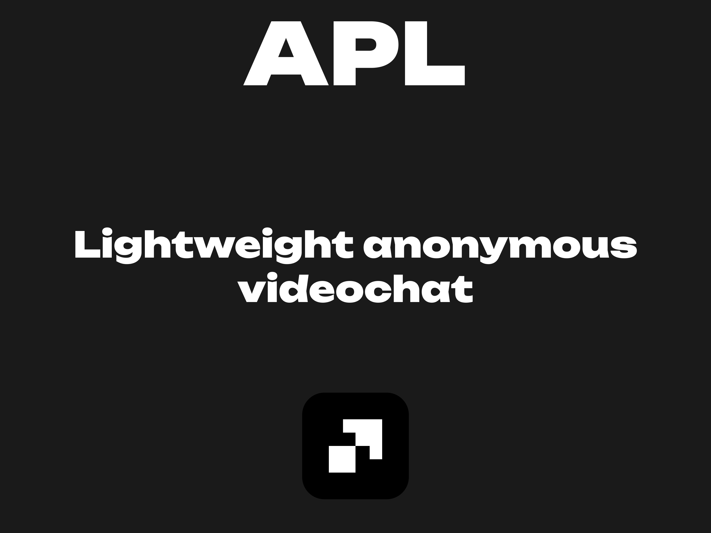

# Anonymous Peer Line [APL]


## About
Light-weight (5kb), open-source video chat application for anonymous peer-to-peer calls. 

Built with WebRTC and Socket.IO, no account required, minimal setup, and fully self-hostable.

## Important
Please note: due to the lightweight architecture, the app may behave unexpectedly in 
non-standard scenarios (e.g., joining a second call without disconnecting from the first).  
Any issues can usually be resolved by simply refreshing the page.

## Usage

1. Make the installation
2. Open client.html

   *If you see "Socket.IO connected", everything is working correctly.* 
4. Select your id and give it other client
5. Connect!

## Installation

Server:

1. Install python3, git
```bash
sudo apt install python3 python3-pip python3-venv git -y
```
2. Create virtual environment
```bash
mkdir ~/apl
cd ~/apl
python3 -m venv venv
source venv/bin/activate
```
3. Install dependencies
```python
pip install flask flask-socketio eventlet
```
4. Clone repository
```bash
git clone https://github.com/yanecoder/apl
```
5. [Optional] Firewall / Port forwarding
```bash
sudo ufw allow 8443/tcp
sudo ufw reload
```
6. Run server.py
```python
python server.py
```

Client:
1. Modify client.html

   Copy your server ipv4 and open client.html

   change server.py, LINE 53:
```js
const socket = io('http://YOUR-SERVER-IPV4:8443');
```

## Modification

### Port changing

Server:

1. Change server.py, LINE 38:

```bash
vim server.py
```
```python
socketio.run(app, host="0.0.0.0", port=YOUR-PORT)
```

2. Forward port
```bash
sudo ufw allow YOUR-PORT/tcp
sudo ufw reload
```

Client:

Change client.html, LINE 53:
```js
const socket = io('http://YOUR-SERVER-IPV4:YOUR-PORT');
```
## Troubleshooting
- If the call does not connect, make sure port 8443 is open and your firewall allows it.
- If the app behaves unexpectedly after reconnecting, refresh the page.

## Contributing

I’m happy if you want to help improve the project!  
Feel free to contribute on GitHub by creating issues, submitting pull requests, or making your own forks. Every contribution is welcome!

## Version
v0.1

Currently, Socket.IO cannot easily serialize media streams, so screen sharing is not available during calls.  
This will be addressed in the next version.

## License

MIT